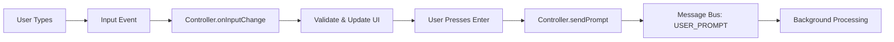
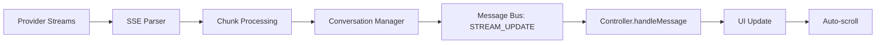
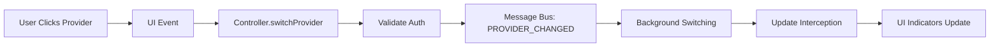

# Panel Wiring Documentation

## Overview
This documentation set details the complete wiring architecture for the Chrome Extension's side panel, covering how it integrates with the streaming system, AI providers, and background services to deliver real-time AI conversation experiences.

## What is Panel Wiring?

Panel wiring refers to the complex interconnections between:
- **User Interface**: Side panel DOM, event handling, state management
- **Background Services**: Message routing, conversation persistence, provider coordination
- **Streaming System**: Real-time chunk processing, SSE parsing, UI updates
- **AI Providers**: ChatGPT, Claude, Gemini integration and switching
- **Browser APIs**: Tab management, permissions, storage, communication

## Documentation Structure

### 🏗️ Architecture & Design
- **[Architecture Overview](Panel-Wiring-Architecture-Overview.md)** - High-level system design and component relationships
- **[Message Flow](Panel-Wiring-Message-Flow.md)** - Detailed message sequences and event routing
- **[State Management](Panel-Wiring-State-Management.md)** - Conversation, UI, provider, and browser state handling

### 🔌 Integration & Features
- **[UI-Streaming Integration](Panel-Wiring-UI-Streaming-Integration.md)** - Real-time streaming updates and visual feedback systems
- **[Provider Switching](Panel-Wiring-Provider-Switching.md)** - Multi-provider support and seamless switching mechanisms
- **[Event Handling](Panel-Wiring-Event-Handling.md)** - Comprehensive user interaction and browser event processing

### ⚡ Performance & Optimization
- **[Performance Considerations](Panel-Wiring-Performance-Considerations.md)** - Optimization strategies for smooth streaming under load

### 📚 Reference & Navigation
- **[Documentation Index](Panel-Wiring-Documentation-Index.md)** - Complete navigation guide and cross-references

## Key Wiring Concepts

### Message Flow Architecture
The panel uses a sophisticated message-passing architecture:

```
User Action → DOM Event → Controller Handler → Message Bus → Background Service → Provider → Streaming Response → UI Update
```

### State Synchronization
Multi-layered state management ensures consistency across:
- **Conversation State**: Message history, streaming status, metadata
- **UI State**: Input values, focus, scroll position, visual indicators
- **Provider State**: Active provider, auth status, capabilities, preferences
- **Browser State**: Current tab, tab history, window focus, permissions

### Performance Optimization
Advanced optimization techniques handle high-throughput streaming:
- **Chunk Batching**: Process multiple chunks in batches for efficiency
- **DOM Optimization**: Minimize reflows with batched updates
- **Memory Management**: Element pooling and intelligent caching
- **Connection Pooling**: Reuse connections for better performance

## Quick Start Guide

### Basic Panel Setup
```javascript
// Initialize the panel controller
import { SidePanelController } from './SidePanelController.js';

const controller = new SidePanelController();

// Controller handles:
// - DOM event binding
// - Message routing
// - State management
// - UI updates
```

### Message Handling
```javascript
// Handle incoming background messages
chrome.runtime.onMessage.addListener((message, sender, sendResponse) => {
  switch (message.type) {
    case 'STREAM_UPDATE':
      controller.updateStreamingMessage(message.content, message.model);
      break;
    case 'MESSAGE_ADDED':
      controller.addMessage(message.role, message.content);
      break;
  }
});
```

### Provider Switching
```javascript
// Switch to different AI provider
await controller.switchProvider('claude');

// Handles:
// - UI indicator updates
// - Background provider switching
// - Conversation isolation
// - Auth validation
```

## Architecture Highlights

### 🧩 Modular Design
- **Separation of Concerns**: UI, messaging, state, and providers are cleanly separated
- **Extensible Architecture**: Easy to add new providers or UI features
- **Message-Based Communication**: Loose coupling between components

### ⚡ High Performance
- **Real-time Streaming**: Sub-100ms chunk processing with smooth UI updates
- **Memory Efficient**: Intelligent caching and cleanup prevent memory leaks
- **Scalable**: Handles multiple concurrent conversations and providers

### 🎯 User Experience
- **Seamless Switching**: Instant provider switching with state preservation
- **Responsive UI**: Immediate feedback for all user interactions
- **Accessibility**: Full keyboard navigation and screen reader support

### 🔒 Security & Privacy
- **Secure Messaging**: Type-safe message validation and routing
- **Permission Management**: Granular control over provider access
- **Data Protection**: Secure token storage and conversation isolation

## Common Wiring Patterns

### User Input Flow


### Streaming Update Flow


### Provider Switching Flow


## Troubleshooting Guide

### Common Issues

#### Messages Not Appearing
```javascript
// Check message routing
console.log('Message received:', message);

// Verify tab ID filtering
if (message.tabId !== currentTabId) {
  console.log('Ignoring message for different tab');
  return;
}
```

#### Streaming Not Updating
```javascript
// Check streaming state
console.log('Streaming message element:', this.streamingMessage);

// Verify DOM updates
this.messagesArea?.scrollTo({
  top: this.messagesArea.scrollHeight,
  behavior: 'smooth'
});
```

#### Provider Switching Failing
```javascript
// Check auth status
const hasAuth = await this.checkProviderAuth(providerId);
if (!hasAuth) {
  console.error('Provider requires authentication');
  return;
}
```

### Performance Debugging
```javascript
// Enable performance monitoring
const averages = performanceMonitor.getAverages();
console.log('Performance metrics:', averages);

// Check for bottlenecks
if (averages.chunkProcessing > 50) {
  console.warn('Slow chunk processing detected');
}
```

## Development Workflow

### Adding New Features
1. **Design**: Define message types and state changes
2. **Implement**: Add handlers in appropriate components
3. **Test**: Verify message routing and state updates
4. **Optimize**: Apply performance optimizations
5. **Document**: Update wiring documentation

### Testing Strategy
1. **Unit Tests**: Component logic and message handling
2. **Integration Tests**: End-to-end user flows
3. **Performance Tests**: Streaming load and memory usage
4. **Accessibility Tests**: Keyboard navigation and screen readers

## Related Resources

### Streaming System Documentation
- [Streaming Adherence - System Architecture](../Streaming-Adherence-System-Architecture.md)
- [Streaming Adherence - Message Flow](../Streaming-Adherence-Message-Flow.md)

### Provider Documentation
- [Streaming Adherence - ChatGPT](../Streaming-Adherence-ChatGPT.md)
- [Streaming Adherence - Claude](../Streaming-Adherence-Claude.md)
- [Streaming Adherence - Gemini](../Streaming-Adherence-Gemini.md)

### Project Documentation
- [Complete Feature Set](../COMPLETE_FEATURE_SET_AND_ARCHITECTURE.md)
- [Modular Refactor Plan](../MODULAR_REFACTOR_PLAN.md)

## Contributing

When modifying panel wiring:
1. Update the relevant documentation files
2. Test message routing thoroughly
3. Verify performance impact
4. Consider accessibility implications
5. Update cross-references in the documentation index

---

*This README provides the entry point for understanding and working with the panel wiring system. For detailed implementation guidance, see the individual documentation files.*</content>
<parameter name="filePath">C:\0-BlackBoxProject-0\vivim-app-og\vivim-app\extensions\chrome\poc\docs\Panel-Wiring-README.md